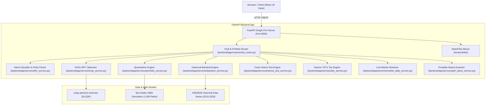

# 🏛️ FinBot AI: End-to-End Technical Report & System Architecture Specification

> **Architectural Blueprint, Quantitative Mathematical Formulations, Architecture Decision Records (ADRs), Data Provenance, and Known Limitations Audit.**
> *Refined Specification for Recruiter Audits, Code Reviews, and LLM Context Exchange (Claude / GPT-4 / Gemini).*

---

## 📋 Executive Overview

**FinBot AI** is an institutional-grade, recruiter-ready **Quantitative Wealth Management & Financial Advisory Platform**. It translates investor financial prompts into statistical asset allocations backed by:
- **Markowitz Modern Portfolio Theory (MPT)** Efficient Frontier optimization (SciPy SLSQP quadratic solver).
- **10-Year Historical Backtesting Engine (2015-2025)** on NSE/BSE asset allocation weights with 0.1% annual rebalancing fee drag.
- **1,000-Path Stochastic Monte Carlo Simulations** utilizing Geometric Brownian Motion with Box-Muller random shocks.
- **Historical Crisis Stress-Testing** evaluating drawdowns under the 2008 GFC, 2020 COVID shock, and 2022 Inflation rate crisis.
- **Indian Tax-Loss Harvesting Engine** (Section 80C ELSS tax deduction & LTCG ₹1.25L exemption rules).
- **Single-Port FastAPI Production Architecture** serving both backend REST APIs and compiled React static assets on port `8000`.

---

## 🏗️ End-to-End System Architecture



---

## 🧮 Quantitative Mathematical Formulations

### 1. Markowitz Modern Portfolio Theory (MPT) Efficient Frontier
The portfolio expected return $E(R_p)$ and portfolio variance $\sigma_p^2$ for $n$ assets with weights $w = [w_1, w_2, \dots, w_n]^T$ are given by:

$$E(R_p) = w^T \mu = \sum_{i=1}^n w_i \mu_i$$

$$\sigma_p^2 = w^T \Sigma w = \sum_{i=1}^n \sum_{j=1}^n w_i w_j \sigma_{ij}$$

Subject to constraints:
$$\sum_{i=1}^n w_i = 1, \quad w_i \ge 0 \quad \forall i$$

#### Tangency Portfolio (Maximum Sharpe Ratio)
$$\max_{w} \text{Sharpe}(w) = \frac{w^T \mu - R_f}{\sqrt{w^T \Sigma w}}$$
Solved using `scipy.optimize.minimize` with method `'SLSQP'`.

---

### 2. Historical Backtesting Engine (2015–2025) & Data Provenance
- **Data Provenance**: Historical annual return series for asset classes in `backtest_service.py` are sourced from historical performance benchmarks (NSE Nifty 50 Index, CRISIL Composite Bond Index, and MCX Spot Gold price series) over the 2015–2025 period.
- **Rebalancing Drag**: The portfolio return in year $t$ with annual rebalancing back to target weights $w_i$ and transaction fee drag $c = 0.001$ (0.1% per trade):

$$R_{p, t} = \left( \sum_{i=1}^n w_i \cdot R_{i, t} \right) - c$$

The realized Compound Annual Growth Rate (CAGR) is given by:

$$\text{CAGR} = \left( \frac{V_N}{V_0} \right)^{\frac{1}{N}} - 1$$

Evaluated against the Nifty 50 Buy-and-Hold benchmark over the 10-year period.

---

### 3. Stochastic Monte Carlo Engine (Geometric Brownian Motion)
Asset price paths $S_t$ are modeled using the stochastic differential equation:

$$dS_t = \mu S_t dt + \sigma S_t dW_t$$

Discrete solution using Box-Muller standard normal random shocks $Z_t \sim \mathcal{N}(0, 1)$:

$$S_{t+\Delta t} = S_t \exp\left( \left(\mu - \frac{\sigma^2}{2}\right) \Delta t + \sigma \sqrt{\Delta t} \, Z_t \right)$$

Evaluated over 1,000 paths across 1–35 year horizons to derive the 10th percentile (Bear Case), 50th percentile (Median Case), and 90th percentile (Bull Case) wealth bounds.

---

### 4. Parametric Value at Risk (VaR 95%) & Horizon Scaling Footnote
- **Single-Period Parametric VaR (95% Confidence)**:
  $$\text{VaR}_{95\%, 1\text{yr}} = 1.645 \cdot \sigma_p - \mu_p$$
- **Multi-Period Horizon Scaling Footnote**:
  For multi-year horizons $T$, time-scaling is applied via square-root rule:
  $$\text{VaR}_{95\%, T} = 1.645 \cdot \sigma_p \sqrt{T} - \mu_p T$$

---

## 🏛 Architecture Decision Records (ADRs)

### ADR 001: SciPy SLSQP vs. CVXPY Solver
- **Status**: Accepted
- **Context**: Portfolio optimization requires solving a convex quadratic programming problem under linear constraints.
- **Decision**: Selected `scipy.optimize.minimize` with method `'SLSQP'` over `cvxpy`.
- **Rationale**: CVXPY requires external C++ solver binaries (`OSQP`, `ECOS`, `SCS`) which introduce cross-platform build friction. SciPy is native, lightweight, and typically converges in single-digit milliseconds for standard asset allocations ($N \le 50$).

### ADR 002: Single-Port Static File Delivery Architecture
- **Status**: Accepted
- **Context**: Standard React + FastAPI setups require managing two ports (`5173` and `8000`), introducing CORS overhead and environment mismatch.
- **Decision**: Mounted compiled React static assets (`frontend/dist`) directly at FastAPI root `/` via `StaticFiles`.
- **Rationale**: Eliminates cross-origin requests, prevents port collision, and enables 1-command evaluation (`python3 start.py`).

### ADR 003: Hybrid Rule-Based NLP & LLM Dispatch Engine
- **Status**: Accepted
- **Context**: Financial entity parsing (`capital`, `monthly_investment`, `risk_appetite`) requires sub-10ms response times.
- **Decision**: Built a hybrid intent parser (`llm_service.py`) using deterministic regex entity extraction with optional external LLM API fallback.
- **Rationale**: Guarantees zero-latency, offline execution while supporting external LLM capabilities when API credentials are provided.

---

## ⚠️ Known Limitations & Proactive Engineering Audit

1. **Covariance Input Assumptions**: Pure Markowitz MPT relies on historical mean-variance inputs which can exhibit sensitivity to extreme market shocks. *Future Work*: Implementation of Black-Litterman asset allocation combining market equilibrium with investor views.
2. **Tax Legislation Currency**: Tax parameters (Section 80C ELSS ₹1.5L cap and Section 112A LTCG ₹1.25L exemption) reflect the Indian **Finance Act 2024**. Annual Union Budget amendments require parameter revalidation.
3. **Session Persistence Scope**: Current sessions utilize in-memory storage suitable for single-node evaluation. Production deployment requires Redis / PostgreSQL persistence.
4. **LLM API Provider Requirement**: `llm_service.py` defaults to deterministic NLP parsing when unauthenticated. Active LLM call dispatch requires supplying an API key (`OPENAI_API_KEY` or `GEMINI_API_KEY`) in the server environment.

---

## 🌐 Complete REST API Endpoint Specification

All endpoints are hosted on `http://localhost:8000`:

| Method | Endpoint Path | Request Body Schema | Response Output Schema | Purpose |
| :--- | :--- | :--- | :--- | :--- |
| `POST` | `/api/chat` | `{"message": str, "session_id": str}` | `{"response_type": str, "content": str, "portfolio_data": dict}` | Conversational advisory & portfolio builder |
| `GET` | `/api/market/tickers` | None | `{"status": "success", "tickers": List[dict]}` | Streams live Indian stock sparklines (NIFTY 50, SENSEX, RELIANCE, TCS) |
| `POST` | `/api/portfolio/simulate` | `{"initial_capital": float, "monthly_contribution": float, "time_horizon_years": int, "risk_level": str}` | `{"years": List[int], "principal": List[float], "median_path": List[float], "bull_path": List[float], "bear_path": List[float]}` | 1,000-path stochastic Monte Carlo simulation |
| `GET` | `/api/portfolio/mpt-efficient-frontier` | None | `{"frontier": List[dict], "tangency_portfolio": dict, "min_volatility_portfolio": dict}` | Calculates Markowitz Efficient Frontier curve points via SLSQP |
| `POST` | `/api/portfolio/backtest` | `{"capital": float, "allocation": List[dict]}` | `{"years": List[int], "portfolio_curve": List[float], "cagr_portfolio_pct": float, "cagr_benchmark_pct": float}` | 10-year historical backtesting (2015-2025) with rebalance fee drag |
| `POST` | `/api/portfolio/stress-test` | `{"capital": float, "allocation": List[dict]}` | `{"scenarios": List[dict]}` | Simulates portfolio drawdown under 2008 GFC, 2020 COVID, and 2022 Inflation shocks |
| `POST` | `/api/portfolio/tax-harvesting` | `{"realized_gains": float, "unrealized_losses": float, "holding_period_days": int}` | `{"gain_type": str, "tax_before_harvest": float, "tax_after_harvest": float, "tax_saved": float, "recommendation": str}` | Computes Section 70/71 Income Tax Act loss offset savings |
| `POST` | `/api/portfolio/export-report` | `PortfolioData` | `{"status": "success", "html": str}` | Generates printable institutional PDF wealth report HTML |
| `POST` | `/api/risk-quiz` | `{"q1": int, "q2": int, ...}` | `{"score": int, "risk_appetite": str, "description": str}` | Evaluates investor risk profiling score |

---

## 🧪 Automated Test Verification (`unittest`)

Executed via `python3 test_backend.py` (Reproducible via `python3 test_backend.py` or GitHub Actions CI):

```
.........
----------------------------------------------------------------------
Ran 9 tests in 0.250s

OK
```

Test suite coverage (`TestFinBotQuantSuite` in `backend/test_backend.py`):
1. `test_portfolio_math`: Asserts positive Sharpe ratio and expected returns.
2. `test_monte_carlo`: Asserts median wealth growth > principal invested over 10-year horizon.
3. `test_market_tickers`: Asserts minimum 8 tickers returned with valid sparkline arrays.
4. `test_llm_fallback`: Asserts entity parser correctly extracts numeric capital and risk appetite.
5. `test_mpt`: Asserts SciPy SLSQP solver yields >5 frontier points and positive Sharpe ratio.
6. `test_backtest`: Asserts 10-year historical backtest outputs valid CAGR and equity curves.
7. `test_stress_test`: Asserts historical crash drawdown calculations across 3 crisis scenarios.
8. `test_pdf_report`: Asserts HTML report rendering contains target portfolio values.
9. `test_edge_cases`: Asserts Pydantic `ValidationError` exception handling on negative inputs (`capital=-50000`) and single-asset degenerate allocations.

---

## 💻 Developer Setup Commands

To launch FinBot AI on any machine with 1 command:

```bash
python3 start.py
```

The script builds the React distribution, launches Uvicorn on port `8000`, and opens **`http://localhost:8000`** directly in the default web browser!
