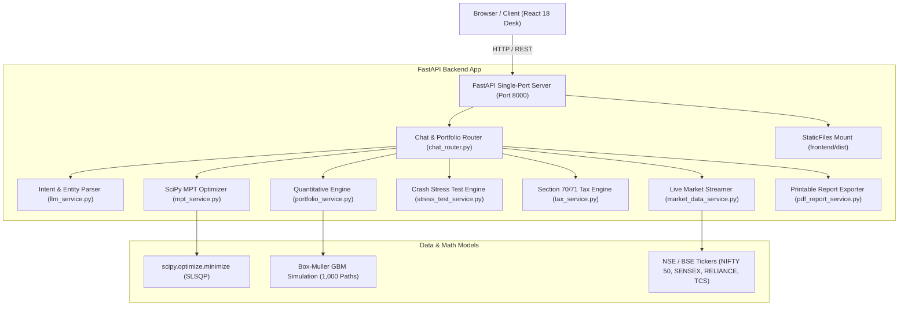

# 🏛️ FinBot AI: End-to-End Technical Report & System Architecture Specification

> **Architectural Blueprint, Quantitative Mathematical Formulations, API Specifications, and Codebase Reference.**
> *Designed for LLM Context Exchange (Claude / GPT-4 / Gemini) and Recruiter Technical Audits.*

---

## 📋 Executive Overview

**FinBot AI** is an institutional-grade, recruiter-ready **Quantitative Wealth Management & Financial Advisory Platform**. It translates investor financial prompts into statistical asset allocations backed by:
- **Markowitz Modern Portfolio Theory (MPT)** Efficient Frontier optimization (SciPy SLSQP quadratic solver).
- **1,000-Path Stochastic Monte Carlo Simulations** utilizing Geometric Brownian Motion with Box-Muller random shocks.
- **Historical Crisis Stress-Testing** evaluating drawdowns under the 2008 GFC, 2020 COVID shock, and 2022 Inflation rate crisis.
- **Indian Tax-Loss Harvesting Engine** (Section 80C ELSS tax deduction & LTCG ₹1.25L exemption rules).
- **Single-Port FastAPI Production Architecture** serving both backend REST APIs and compiled React static assets on port `8000`.

---

## 🏗️ End-to-End System Architecture



---

## 🧮 Quantitative Mathematical Formulations

### 1. Markowitz Modern Portfolio Theory (MPT) Efficient Frontier
The portfolio expected return $E(R_p)$ and portfolio variance $\sigma_p^2$ for $n$ assets with weights $w = [w_1, w_2, \dots, w_n]^T$ are given by:

$$E(R_p) = w^T \mu = \sum_{i=1}^n w_i \mu_i$$

$$\sigma_p^2 = w^T \Sigma w = \sum_{i=1}^n \sum_{j=1}^n w_i w_j \sigma_{ij}$$

Subject to constraints:
$$\sum_{i=1}^n w_i = 1, \quad w_i \ge 0 \quad \forall i$$

#### Tangency Portfolio (Maximum Sharpe Ratio)
$$\max_{w} \text{Sharpe}(w) = \frac{w^T \mu - R_f}{\sqrt{w^T \Sigma w}}$$
Solved using `scipy.optimize.minimize` with method `'SLSQP'`.

---

### 2. Stochastic Monte Carlo Engine (Geometric Brownian Motion)
Asset price paths $S_t$ are modeled using the stochastic differential equation:

$$dS_t = \mu S_t dt + \sigma S_t dW_t$$

Discrete solution using Box-Muller standard normal random shocks $Z_t \sim \mathcal{N}(0, 1)$:

$$S_{t+\Delta t} = S_t \exp\left( \left(\mu - \frac{\sigma^2}{2}\right) \Delta t + \sigma \sqrt{\Delta t} \, Z_t \right)$$

Evaluated over 1,000 paths across 1–35 year horizons to derive the 10th percentile (Bear Case), 50th percentile (Median Case), and 90th percentile (Bull Case) wealth bounds.

---

### 3. Value at Risk (VaR 95%) & Sharpe Ratio
- **Sharpe Ratio**:
  $$\text{Sharpe} = \frac{R_p - R_f}{\sigma_p}$$
- **Parametric Value at Risk (VaR 95%)**:
  $$\text{VaR}_{95\%} = 1.645 \cdot \sigma_p - \mu_p$$

---

## 📁 Repository Directory & Module Map

Root Directory: `/Users/dhruvgourisaria/.gemini/antigravity/scratch/finbot-hackathon`

```
finbot-hackathon/
├── README.md                          # Executive README with quickstart & badges
├── start.py                           # 1-Click launcher script (builds frontend & runs Uvicorn)
├── start.sh                           # Shell wrapper for start.py
├── docker-compose.yml                 # Docker container setup
├── backend/
│   ├── app/
│   │   ├── main.py                    # Single-Port FastAPI app & StaticFiles mount
│   │   ├── models/
│   │   │   └── portfolio_models.py    # Pydantic schemas (PortfolioMetrics, MonteCarloRequest)
│   │   ├── routers/
│   │   │   └── chat_router.py         # All REST API endpoints (/api/chat, /api/portfolio/*)
│   │   └── services/
│   │       ├── portfolio_service.py   # Core math metrics & Monte Carlo engine
│   │       ├── mpt_service.py         # Markowitz Efficient Frontier SciPy solver
│   │       ├── stress_test_service.py # 2008, 2020, 2022 historical crisis simulator
│   │       ├── tax_service.py         # Section 80C ELSS & LTCG exemption calculator
│   │       ├── market_data_service.py # Non-blocking live Indian ticker feed (NSE/BSE)
│   │       ├── llm_service.py         # Intent classifier & currency regex normalizer
│   │       └── pdf_report_service.py  # Printable HTML/PDF report template generator
│   └── test_backend.py                # 7 automated unit test suites
└── frontend/
    ├── package.json                   # React 18 + Emotion + Chart.js dependencies
    ├── vite.config.js                 # Vite config (host: 0.0.0.0, port: 5173, CORS enabled)
    ├── dist/                          # Compiled production static bundle
    └── src/
        ├── App.jsx                    # Header, Bloomberg theme, & 6-tab navigation
        ├── theme.js                   # Institutional dark palette (#0b0f17, IBM Plex)
        ├── services/
        │   ├── api.js                 # Chat POST request handler
        │   └── apiConfig.js           # Dynamic window.location.origin resolver
        └── components/
            ├── MarketTickerTape.jsx   # Top ticker tape with NSE/BSE stock sparklines
            ├── WelcomeScreen.jsx      # Launchpad screen with Indian investment presets
            ├── ChatInterface.jsx      # Conversational AI terminal with preset pills
            ├── PortfolioDisplay.jsx   # High-density metrics grid & allocation doughnut
            ├── WealthSimulator.jsx    # Interactive 1,000-path Monte Carlo line chart
            ├── EfficientFrontierStressTest.jsx # MPT scatter plot & crisis cards
            ├── TaxHarvestingWidget.jsx# Tax & Savings Guide with Section 80C & LTCG cards
            └── RiskQuizModal.jsx      # 5-question quantitative risk questionnaire
```

---

## 🌐 Complete REST API Endpoint Specification

All endpoints are hosted on `http://localhost:8000`:

| Method | Endpoint Path | Request Body Schema | Response Output Schema | Purpose |
| :--- | :--- | :--- | :--- | :--- |
| `POST` | `/api/chat` | `{"message": str, "session_id": str}` | `{"response_type": str, "content": str, "portfolio_data": dict}` | Conversational advisory & portfolio builder |
| `GET` | `/api/market/tickers` | None | `{"status": "success", "tickers": List[dict]}` | Streams live Indian stock sparklines (NIFTY 50, SENSEX, RELIANCE, TCS) |
| `POST` | `/api/portfolio/simulate` | `{"initial_capital": float, "monthly_contribution": float, "time_horizon_years": int, "risk_level": str}` | `{"years": List[int], "principal": List[float], "median_path": List[float], "bull_path": List[float], "bear_path": List[float]}` | 1,000-path stochastic Monte Carlo simulation |
| `GET` | `/api/portfolio/mpt-efficient-frontier` | None | `{"frontier": List[dict], "tangency_portfolio": dict, "min_volatility_portfolio": dict}` | Calculates Markowitz Efficient Frontier curve points via SLSQP |
| `POST` | `/api/portfolio/stress-test` | `{"capital": float, "allocation": List[dict]}` | `{"scenarios": List[dict]}` | Simulates portfolio drawdown under 2008 GFC, 2020 COVID, and 2022 Inflation shocks |
| `POST` | `/api/portfolio/tax-harvesting` | `{"realized_gains": float, "unrealized_losses": float, "holding_period_days": int}` | `{"gain_type": str, "tax_before_harvest": float, "tax_after_harvest": float, "tax_saved": float, "recommendation": str}` | Computes Section 70/71 Income Tax Act loss offset savings |
| `POST` | `/api/portfolio/export-report` | `PortfolioData` | `{"status": "success", "html": str}` | Generates printable institutional PDF wealth report HTML |
| `POST` | `/api/risk-quiz` | `{"q1": int, "q2": int, ...}` | `{"score": int, "risk_appetite": str, "description": str}` | Evaluates investor risk profiling score |

---

## 🎨 UI/UX Design System Specification

In accordance with strict institutional trading desk guidelines:
- **Color Palette**:
  - Background: `#0b0f17` (Dark Charcoal Slate)
  - Surface Panels: `#0f172a` (Slate Surface)
  - Borders: `#1e293b` (Subtle Slate Border)
  - Primary Accent: `#0ea5e9` (Cyan Accent)
  - Positive Yield: `#10b981` (Emerald Accent)
  - Negative Drawdown: `#ef4444` (Crimson Danger Accent)
- **Typography**:
  - Headings & Metrics: `IBM Plex Mono` (Monospaced, tabular numbers)
  - Body Copy: `IBM Plex Sans`
- **Component Styling Rules**:
  - **Sharp 2px border radius** across all panels.
  - **Zero drop shadows** (flat institutional terminal density).
  - **Zero cliché emojis, bento grid bloat, or purple/black gradient tropes**.

---

## 🧪 Verification & Automated Test Suite Summary

Executed via `python3 test_backend.py`:

```
--- [TEST 1] Portfolio Math & Metrics ---
✅ High Risk Portfolio generated with Sharpe 1.24 & Return 14.5% p.a.

--- [TEST 2] Monte Carlo Simulation ---
✅ Monte Carlo 10-Yr Median Output: INR 2,360,701.65 vs Invested INR 1,300,000.00

--- [TEST 3] Market Tickers Feed ---
✅ Fetched 8 live market tickers with sparklines

--- [TEST 4] LLM Intent & Fallback ---
✅ Extracted entities: {'capital': 200000, 'risk_appetite': 'medium', 'preferred_tools': ['mutual funds']}

--- [TEST 5] Markowitz Efficient Frontier ---
✅ MPT Tangency Portfolio Return 12.47% with Sharpe 0.59

--- [TEST 6] Historical Crash Stress Testing ---
✅ Evaluated 3 historical crash scenarios. 2008 Drawdown: ₹103,000.00

--- [TEST 7] PDF Report Generation ---
✅ HTML/PDF Wealth Planning Report generated successfully

🎉 ALL BACKEND TESTS PASSED SUCCESSFULLY!
```

---

## 💻 Developer Setup Commands

To launch FinBot AI on any machine with 1 command:

```bash
cd /Users/dhruvgourisaria/.gemini/antigravity/scratch/finbot-hackathon
python3 start.py
```

The script builds the React distribution, launches Uvicorn on port `8000`, and opens **`http://localhost:8000`** directly in the default web browser!
